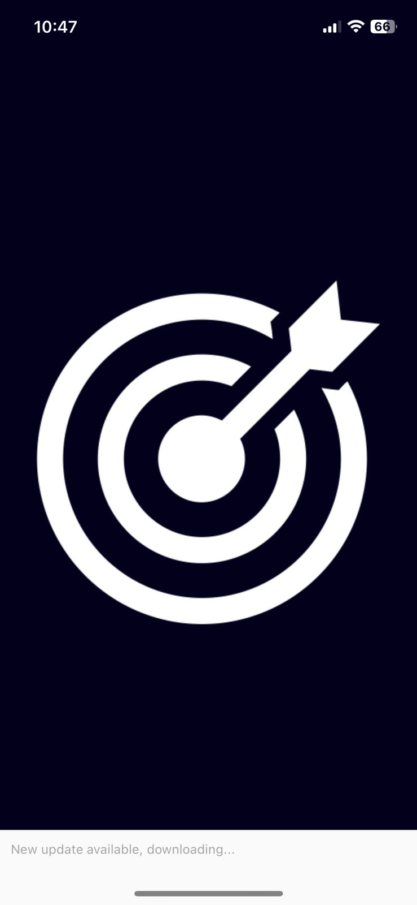
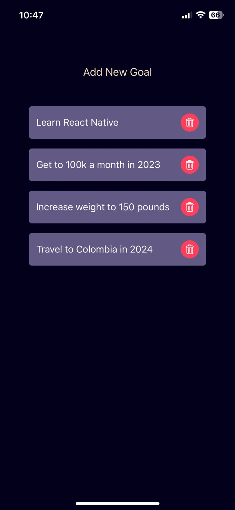
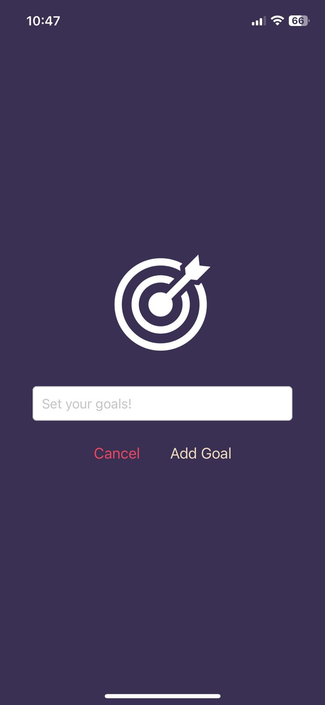

# GoalSetter App


## Splash Screen



## Main Screen



## Modal/Input Screen



## Description

Minimalist frontend mobile application for the user to save short tearm goals with
just running the app once and letting it work in the background.

Status: Finished  

## Tecnologies

<ul> 
    <li> React Native </li>
    <li> Native Styles </li>
    <li> Expo CLI </li>
</ul>

## Available Scripts & Steps

In the project directory, you can run:

```
npm start
```

- First, download Expo in your device.
- Run the app in the development mode with the mentioned command "npm start".
- Open the QR code on your device using the built in camera.

The screen will reload when you make changes.\
You may also see any lint errors in the console.